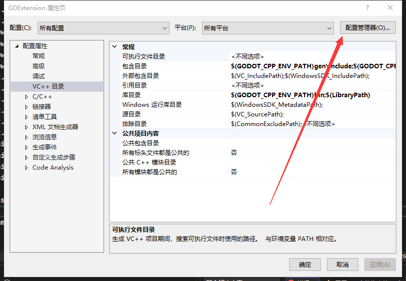
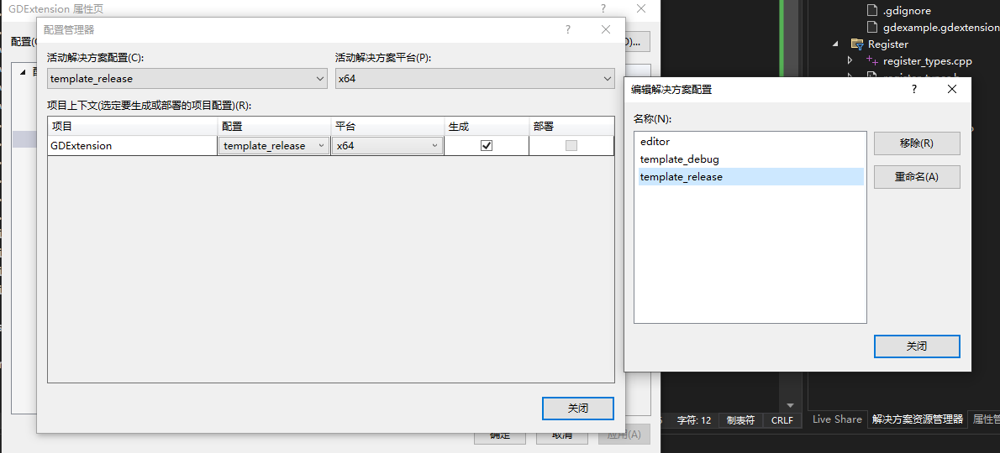
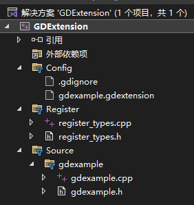
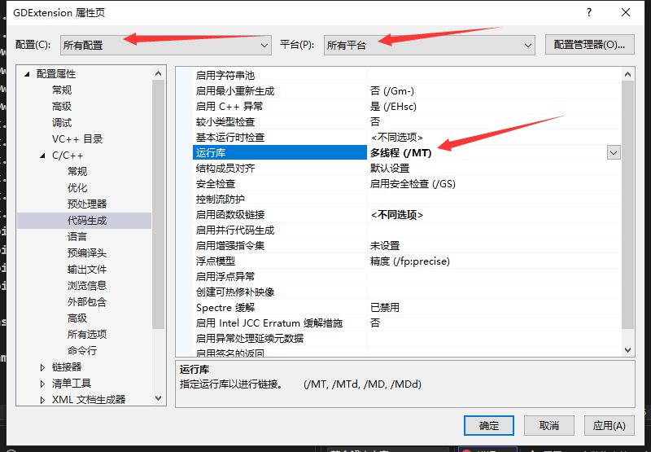
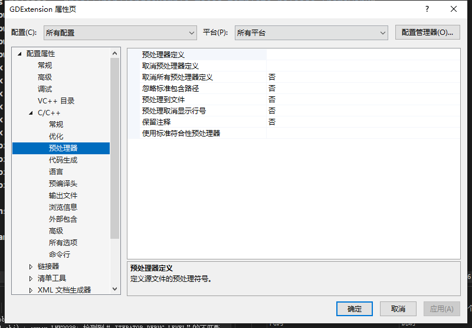

<style type="text/css">
    h1 { counter-reset: h2counter; }
    h2 { counter-reset: h3counter; }
    h3 { counter-reset: h4counter; }
    h4 { counter-reset: h5counter; }
    h5 { counter-reset: h6counter; }
    h6 { }
    h2:before {
      counter-increment: h2counter;
      content: counter(h2counter) ".\0000a0\0000a0";
    }
    h3:before {
      counter-increment: h3counter;
      content: counter(h2counter) "."
                counter(h3counter) ".\0000a0\0000a0";
    }
    h4:before {
      counter-increment: h4counter;
      content: counter(h2counter) "."
                counter(h3counter) "."
                counter(h4counter) ".\0000a0\0000a0";
    }
    h5:before {
      counter-increment: h5counter;
      content: counter(h2counter) "."
                counter(h3counter) "."
                counter(h4counter) "."
                counter(h5counter) ".\0000a0\0000a0";
    }
    h6:before {
      counter-increment: h6counter;
      content: counter(h2counter) "."
                counter(h3counter) "."
                counter(h4counter) "."
                counter(h5counter) "."
                counter(h6counter) ".\0000a0\0000a0";
    }
</style>

# 写在最前
* 本篇教程基于之前教程，并且默认为Windows10，64位，Godot版本4.1.3
* 如果遇到任何问题，欢迎及时提出，如果配置成功了请点个赞，球球啦。

# 编译godot-cpp库
* 在github中的godot-cpp页面下载源代码
* 在压缩包解压后的根目录中有SContruct，利用scons命令编译，生成的库在bin文件夹中
# 添加环境变量
* 在环境变量中添加GODOT_CPP_ENV_PATH，并设置路径为之前压缩包解压的根目录

# 配置新工程文件操作
* 配置项目目录，使vs工程可以直接创建在godot的res://src/下
* 点击生成即可自动生成更新res://bin/ 下的dll

## 切换vs项目配置名称
* 打开项目属性页的配置管理器

 




* 将默认的Debug与Release改为editor，template_debug, template_release, 其中editor由debug复制而来，剩下两个一一对应。

  




## 包含目录包含:

* 在vs工程的VC++目录中的包含目录包含：
```
$(GODOT_CPP_ENV_PATH)gen\include
$(GODOT_CPP_ENV_PATH)gdextension
$(GODOT_CPP_ENV_PATH)include
```

## 库目录包含:
* 在vs工程的VC++目录中的库目录包含：
```
$(GODOT_CPP_ENV_PATH)bin
```

## 链接器-输入:
* 添加一下代码，用于添加对应的lib文件
```
libgodot-cpp.windows.$(Configuration).x86_64.lib
```

## 输出与中间路径
* 输出路径
```
$(SolutionDir)..\..\bin
```
* 中间路径
```
IntDir\$(Configuration)\
```
* 输出名称
```
libgdexample.windows.$(Configuration).x86_64
```

## 插入基本example&register_type
* 在官网链接：https://docs.godotengine.org/en/stable/tutorials/scripting/gdextension/gdextension_cpp_example.html 可找到:
```
    register_types.cpp
    register_types.h
    example.cpp
    example.h
    gdexample.gdextension
```
* **!!注意!!** x.gdextension 的编码格式要求为LF与UTF-8(No Bom)，而默认VS对文本文件的编码不是如此，故一定注意需要改编码（通过force utf-8(no bom)插件或者高级保存选项）
* 将它们的代码复制并创建在你的工程里，一个示例如下（其中可创建.gdignore在中间目录下，放置每次obj都被错误导入）：



  

 

## c++生成-运行库
### 问题
* Link2038
* _ITERATOR_DEBUG_LEVEL 的不匹配项
* 检测到"RuntimeLibrary"的不匹配项
### 方法
* 将项目属性的c/c++下的代码生成中的运行库改为/MT

  



## 预处理器
### 问题
* 同上

### 方法
* 将预处理器定义清空

  



# 简化操作
* 相关文件以上传github， 链接：

## 编译脚本
* 写成.bat, 放入godot-cpp解压缩的根目录路，并运行
```
scons target=editor
scons target=template_debug
scons target=template_release
```

## 环境变量脚本
* 写成.bat, 放入godot-cpp解压缩的根目录路，并运行
```
setx GODOT_CPP_ENV_PATH %~dp0
```

## VS工程模板
* 将配置好的vs工程，导出为模板。
* 使用时，便可以直接在你的godot项目目录res://src/ 创建你的vs项目